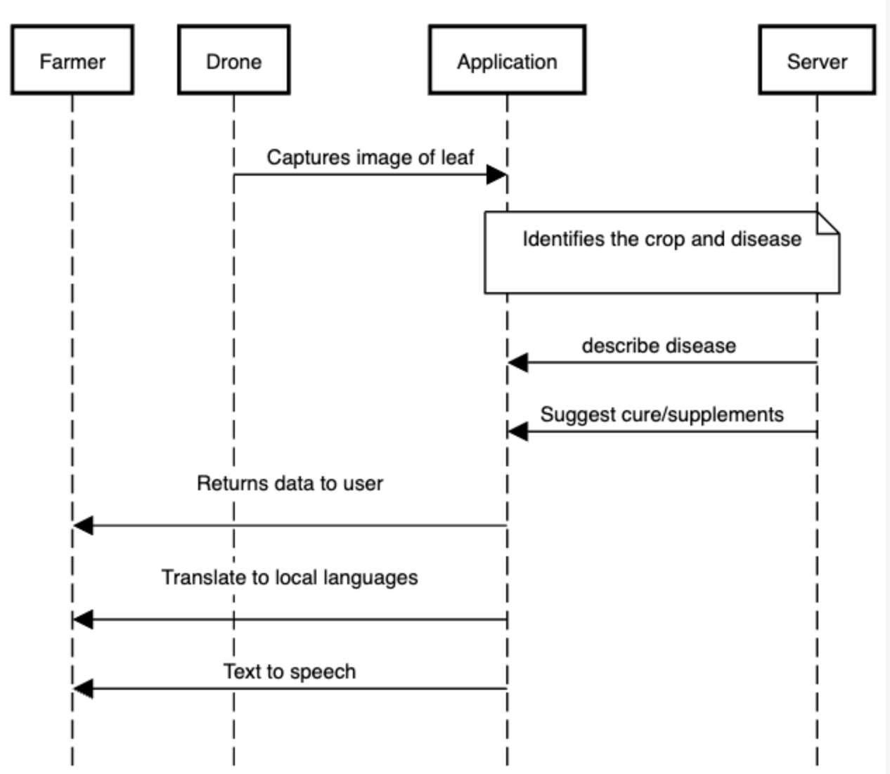

# Gen-Ai-Rush-Buildathon

## Submission Instruction:
  1. Fork this repository
  2. Create a folder with your Team Name
  3. Upload all the code and necessary files in the created folder
  4. Upload a **README.md** file in your folder with the below mentioned informations.
  5. Generate a Pull Request with your Team Name. (Example: submission-XYZ_team)

## README.md must consist of the following information:

#### Team Name - AI Alchemists
#### Problem Statement - Empowering farmers with AI-driven plant disease detection for enhanced crop health and yield
#### Team Leader Email - jaishana25@gmail.com

## A Brief of the Prototype:
  
  


  Protoype: The prototype is a web-based platform designed for farmers to identify and address crop diseases efficiently.

- Farmers can easily upload images of their crops experiencing potential disease symptoms through the user-friendly interface.

- Advanced machine learning algorithms analyze the uploaded images, accurately detecting the presence of diseases and identifying the specific crop affected.

- Beyond detection, the prototype provides tailored cure and supplement suggestions based on an extensive database of remedies compiled in collaboration with agricultural experts.

- Farmers receive prompt results, enabling them to take immediate action and prevent disease spread, optimizing agricultural productivity.

- The platform's continuous learning process includes regular updates to its dataset and model to adapt to emerging diseases and changing agricultural conditions.

- Regular enhancements and refinements ensure the prototype remains up-to-date, reliable, and capable of meeting the evolving needs of the farming community.

- The crop disease detection prototype represents a groundbreaking advancement in precision agriculture, leading to enhanced crop health, increased yields, and sustainable agricultural practices.
  
## Tech Stack: 
● Next.js
● Tailwind CSS
● Flask
● TensorFlow
● Keras
● Python
● Docker
   
## Step-by-Step Code Execution Instructions:
  - Clone this repository ```git clone https://github.com/jaishana25/gen-ai-rush-buildathon.git```
  - ```cd '.\gen-ai-rush-buildathon\AI Alchemists\'```

  - In the FlaskDeployedApp folder in the backend folder, download the model from ```https://drive.google.com/file/d/1Pzcr3PVroZgYs2kp9mw9dXx36sfsnx3U/view?usp=sharing``` and place it.
  - Start up the backend server with the following command: 
  ```
  cd backend
  cd FlaskDeployedApp
  pip install -r requirements.txt
  python app.py
  ```
  - Start the React App in another terminal:
  ```
  cd client
  npm install
  npm start
  ```
  - Access the React App on ```localhost:3000```
  
## What I Learned:
  The biggest learning during the development of the crop disease detection prototype was the significant impact of data quality and diversity on the effectiveness of the system. In order to create an accurate and reliable model, we needed a diverse dataset of crop images representing various diseases, growth stages, lighting conditions, and environmental factors.

  Another key learning was the need for a user-friendly interface. Farmers and users without technical expertise needed a simple and intuitive platform to upload images, receive prompt results, and understand the suggested cures and supplements. 
