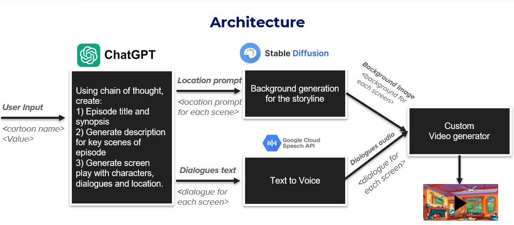

# Gen-Ai-Rush-Buildathon

#### Team Name - Angris
#### Problem Statement - Parents worry that their kids watch a lot of cartoons without getting any value from it. 
#### Solution - An application, that has a curated list of cartoons styles to choose from and takes parents inputs to generates a personalized cartoon episode in the requested cartoon theme and values.   
#### Team Leader Email - vinokrish001@gmail.com

## We are refraining from open-sourcing the code and got permission from H2S team, as we are building a product around it  

## Generated final output:

## A Brief of the Prototype:

  
  - We are using GPT with chain of thought prompting to generate the story and screenplay for the chosen cartoon and kids value
  - The screenplay provides insights which is directed towards stable diffusion to generate the scene environments
  - The textual screenplay is converted into mp3 using Google Wavenet
  - Programming and frame manupilation is used with the GPT generated screenplay to generate the final video

## Tech Stack: 
   - GPT3.5 API 
   - Stable Diffusion
   - Google Wavenet
   - Python Flask Server
   - MongoDD
   - Azure VM
   - Netlify

   
## What we Learned:
   - Chain of thought prompting techniques
   - Integrating responses from different GenAI models  
   - Building an end to end pipeline for video generation from fundamentals
   

