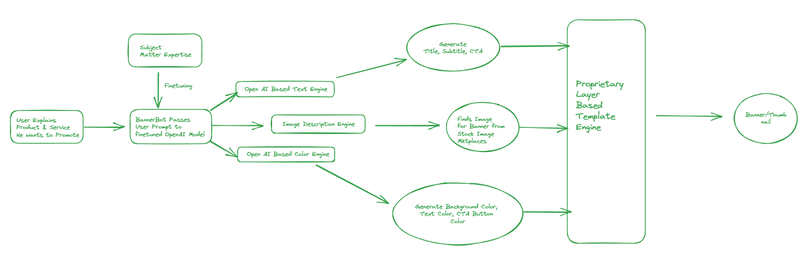

#### Team Name

Bannerbot

#### Problem Statement

Creating marketing banners and YouTube thumbnails is a time-consuming and costly task

The self-serve tools available in the market either have very high learning curve or require expertise in graphic design subjects

#### Team Leader Email -

varunon9@gmail.com

## A Brief of the Prototype:

Architecture Diagram-

 

Prototype Demo: https://www.youtube.com/watch?v=7uBux81OGIs  

[Final submission](./Bannerbot-final-submission.pptx.pdf)
  
## Tech Stack: 

FE: Flutter
BE: Node
AI: GPT-3.5
Image engine: Freepik APIs

   
## Step-by-Step Code Execution Instructions:

1. `flutter` folder contains source code of Flutter app
2. `lambda` folder contains source code of API deployed on AWS lambda

### Flutter setup

1. Make sure that you have Flutter setup done on your machine
2. To check missing dependencies `flutter doctor -v`
3. `cd flutter`
4. Run app using `flutter run`

### Lambda function

1. Use your own OpenAI & Freepik API keys
2. Deploy the function on AWS lambda or similar infra
3. Consume the generated API endpoint in flutter app (`generate_thumbnails_actions.dart`)
  
## What I Learned:

We built the 'Youtube thumbnail generator,' an additional feature in our app, Bannerbot. We brainstormed the product and logic, fine-tuned our prompt, and integrated frontend and backend components. We also interacted with other participants, our mentors, and received their feedback.

Apart from the technical aspect, I personally also learned about product development, presentation, and pitching.