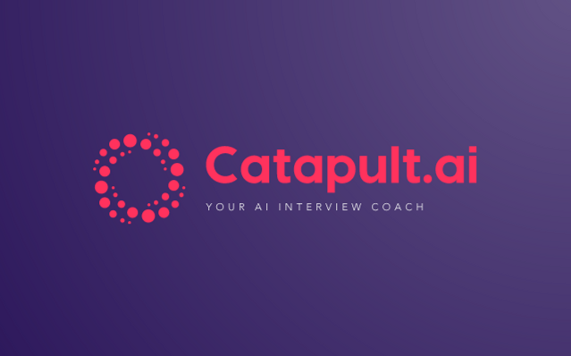
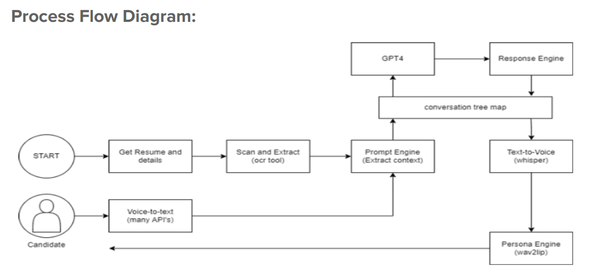

# Gen-Ai-Rush-Buildathon

#### Team Name - Catapult
#### Problem Statement - 
Many candidates, especially from lower social tiers, lack real-world interview experience and struggle with nervousness, leading to suboptimal performance in actual interviews. Existing interview preparation methods often fall short in providing sufficient practice opportunities and personalized feedback.
#### Team Leader Email -
shreeyash dot s dot pawar at gmail.com
## A Brief of the Prototype:
  
  
## Tech Stack: 
   List Down all technologies used to Build the prototype
   
## Step-by-Step Code Execution Instructions:
## Catapult Frontend

## React JS
This project was bootstrapped with [Create React App](https://github.com/facebook/create-react-app).

Node version : 16.17

### Setup

Go to the `catapult-frontend` folder -> 

1. `node --version` -- needs 16.17 
2. `npm install`
(if dependency error is shown  - run `npm install --force` instead)
3. Verify details in `/src/config.js` file 
4. `npm start`

## Catapult Backend 
### FastAPI + Speech Processing + Video Generation

#

#### Setup

Go to `catapult-backend` folder ->

1. `python3 --version` -- needs 3.11
2. `python3 -m venv env_dev`
3. `source ./env_dev/bin/activate`
4. `pip install -r requirements.txt`
4. Verify detials in `.env` file
5. `python3 -m uvicorn main:app --reload`

  
## What we Learned:
Working with LLM's and NLP
AI talking head generation landscape and models
Multimedia streaming (most difficult!)
Advanced FastAPI
