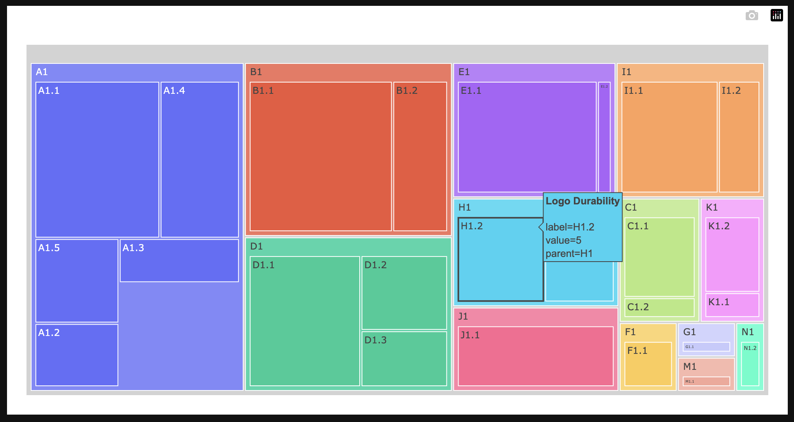
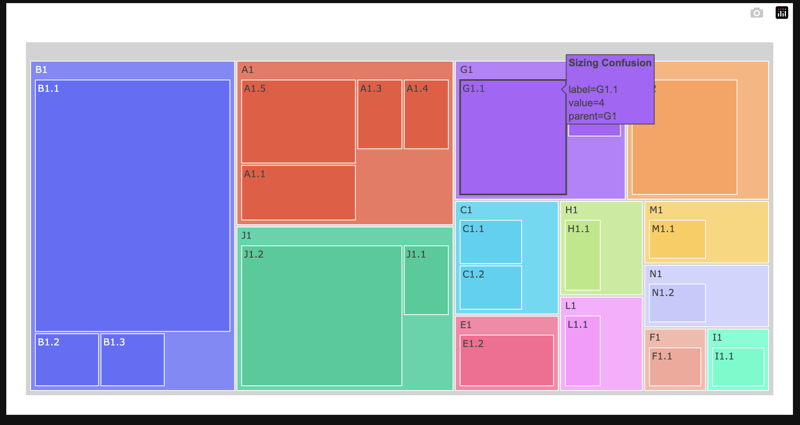

# Gen-Ai-Rush-Buildathon

## Submission Instruction:

1. Fork this repository
2. Create a folder with your Team Name
3. Upload all the code and necessary files in the created folder
4. Upload a **README.md** file in your folder with the below mentioned informations.
5. Generate a Pull Request with your Team Name. (Example: submission-XYZ_team)

## README.md must consist of the following information:

#### Team Name - Singularity Squad

#### Problem Statement - Fashion Trend Intelligence

#### Team Leader Email - nyrp11@gmail.com

## A Brief of the Prototype:

Treemap (Positive Reviews):

Treemap (Negative Reviews):

## Tech Stack:

OpenAI GPT-4 for all data analysis and parsing

## Step-by-Step Code Execution Instructions:

This Section must contain a set of instructions required to clone and run the prototype so that it can be tested and deeply analyzed

## What I Learned:

Write about the biggest learning you had while developing the prototype
