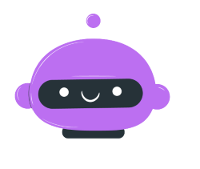

  

<h1 align="center" >Saha-AI: An AI-Powered Call Management System for Emergency Services</h1>

  
  
  
  

Saha-AI is an innovative call management system that uses artificial intelligence (AI) to help prioritize emergency calls when no handlers are available. By analyzing the keywords and recording the location of callers, Saha-AI can grade the importance of each call and quickly transfer the relevant information to the respective handler. This system helps emergency services to respond more efficiently and effectively to urgent situations.

 

- <a href="https://team-allies-gen-ai-rush2023-tl7z.vercel.app/">Deployed Website Frontend</a>    
- <a href="https://replit.com/@WebxSpark/GracefulShabbyMathematics"> Replit Deployment Link - Call Management System </a>
- <a href="https://replit.com/@WebxSpark/chatbot"> Replit Deployment Link - Chat Management System </a>

 

## 📝 Submission Info:

- <b>Team Name </b> - Team Allies
- <b>Team Leader Email</b> - jinianayak.tbn@gmail.com

 

## 🤔 The problem Statement

In emergency situations, every second counts. However, when the emergency call center is overwhelmed or understaffed, callers may have to wait for a long time before their call is answered. This delay can be critical and could result in a loss of life or property. Our hackathon project, Saha-AI, solves this problem by using artificial intelligence to grade the importance of each call and transfer the relevant information to the emergency handler. This helps emergency services to respond more efficiently and effectively, potentially saving lives and reducing property damage.

 

## 📋 A Brief of the Prototype:
Emergency situations are unpredictable and every second matters . At times when emergency call centers is overwhelmed or understaffed , the wait time gets longer . Our Project Saha-AI , solves this problem with the help of Artificial Intelligence , attend the calls , prioritise an emergency and dispatch help on the basis of the details provided by the caller . Our Chat Bot feature helps people in resolving the emergency situation by themselves . The situation is further under control by constant support of the bot.

The Following is the UML Architecture Diagram of the project:

SahaI-AI is an innovative solution designed to revolutionize emergency call centers by addressing the critical issue of lengthy wait times during emergencies. Powered by Artificial Intelligence, Saha-AI swiftly attends to calls, prioritizes emergencies based on caller details, and dispatches appropriate help promptly. The system's integrated Chat Bot provides instant guidance and support to callers, empowering them to take immediate actions that can make a difference before professional help arrives. With its dynamic resource allocation, Saha.AI ensures that emergency call centers remain effective and responsive, even during high-demand situations. This constant support throughout the emergency helps alleviate panic and keeps callers informed, contributing to better outcomes during challenging situations. Overall, Saha.AI is a powerful tool that optimizes response times and fosters a safer and more efficient emergency management system.

 

## ⚙️ TechStack :
  
   

 

## ✨ Features

- AI-powered call management: Saha-AI uses natural language processing (NLP) and machine learning (ML) to identify the urgency of each call and prioritize them accordingly.
- Call grading : Saha-AI grades each call based on the sevierity of situation spoken by the caller. This allows the system to quickly identify urgent calls and transfer them to the emergency handler.
- Location tracking: Saha-AI also records the location of each caller and provides this information to the handler.
- Call transcript: Saha-AI provides a transcript of each call to the emergency handler, allowing them to quickly and accurately assess the situation and respond accordingly.
- Automated responses: In some cases, Saha-AI can provide automated responses to callers to guide them through emergency situations until an emergency handler is available.
- Chat Assistance: In cases when someone needs general consultancy for emergency situation , the chat feature can be used to get quick and reliable consultancy.
- SOS Numbers: For older people or children, it is important that a guardian is informed in case of any emergency involving them, hence using the SOS number feature, the SOS number is notified if any emergency call is made.

 

## 🤖 Step-by-Step Code Execution Instructions:

- open the operator dashboard or chat app here : <a href="https://team-allies-gen-ai-rush2023-tl7z.vercel.app/">Deployed Website Frontend</a> 
- The operator dashboard is protected by a ethereum whitelist, please contact us at siddharthabhatt2345@gmail.com or 7002744892 with your wallet address to get whitelisted.
- Press connect wallet and the operator dashboard will open (metamask extension needed)
- Make a call to the helpline number and state your problem.
- The problem will show up in the dashboard in no time, with one click , change the message status to dispatched or completed.
- The ChatBot can be accessed without being whitelisted by anyone. Only admin dashboard needs whitelisting.

- <a href="https://replit.com/@WebxSpark/GracefulShabbyMathematics"> Replit Deployment Link - Call Management System </a>
- <a href="https://replit.com/@WebxSpark/chatbot"> Replit Deployment Link - Chat Management System </a>

 

## 💡 What I Learned:

While working on the project we faced multiple challanges and made many mistakes, each mistake taught us a leason, such as always check if you have added the env files to gitignore or else you'll loose all your API keys.
We also have gained a better understanding of Gen AI while training our chatBot , we got a better insight into hosting and event handling while working with twilio calls. 
Apart from that, we got to connect with many amazing knowledgable people and we learnt a lot from them, we shared ideas with other participants and learnt a lot from each other.

 

## ✅ How Saha-AI Works

When a caller dials the handler and there are no available handlers, the call is automatically redirected to the Saha-AI system. The system then asks the caller to describe the emergency situation and uses NLP and ML algorithms to analyze the content of the call. Based on the keywords and phrases used by the caller, the system grades the importance of the call and assigns it a priority level.

If the call is urgent, Saha-AI will immediately transfer the relevant information to the handler. This information includes the caller's location, a transcript of the call, and any other relevant details. If the call is less urgent, Saha-AI may provide automated responses to guide the caller through the situation until a emergency handler is available.

 

## ▶️ Installation and Usage
To use Saha-AI, simply integrate the system with your emergency services call center. The system can be easily customized to meet the specific needs of your organization. Saha-AI is compatible with most modern phone systems and can be configured to work with any existing emergency call management software.

From a customer's perspective, just dial the number or open the chat app.

For The Judges, To test the app out, dial the helpline number and open the operator dashboard. The operator dashboard is protected by a whitelist, In order to get access to the organiser dashboatd , Kindly contact me with your ethereum wallet address at : [siddharthabhatt2345@gmail.com](mailto:siddharthabhatt2345@gmail.com)

 

## 🌱 Contributing
We welcome contributions from developers and emergency services professionals who are interested in improving the Saha-AI system. If you would like to contribute, please fork this repository and submit a pull request with your changes.

 

## ©️ License
Saha-AI is licensed under the MPL-2.0 License. See <a href="LICENSE.txt">LICENSE</a> for details.

 

## 📞 Contact Us
If you have any questions or feedback about the Saha-AI system, please don't hesitate to contact us - 
 

<a href="https://linktr.ee/SiddharthaBhattacharjee"> Siddhartha Bhattacharjee </a>  
<a href="https://www.linkedin.com/in/bhupalam-venkata-datta-sai-9408371b5/"> B V DattaSai </a>  
<a href="https://linktr.ee/prayasu"> Prayasu Satapathy </a>  
<a href="https://www.linkedin.com/in/jinia-nayak-460162229/"> Jiniya Nayak </a>  

