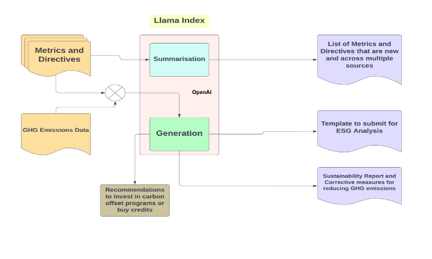

# Gen-Ai-Rush-Buildathon

#### Team Name - Greenloner
#### Problem Statement - Enterprises face challenges in creating timely and accurate GHG emission reports according to the latest metrics and directives. The current manual procedure takes one to two quarters, which impedes compliance and sustainability initiatives. To automate report generation, cater to enterprises of various sizes, and ensure fast observance of environmental regulations, a solution is required.
#### Team Leader Email - josephthachil.mec@gmail.com

## A Brief of the Prototype:
  

  - Automate the process of creation of GHG emissions using the existing template the firm
    uses
  - Train a custom LLM with every new iteration of directives and metrics
  - Basis the input from the organisation, we would generate the GHG emission report for the
    organisation
  - Basis the predetermined threshold, we would generate suggestions and roadmaps for the
    organisation to reduce their emissions going into the next year
  - Generate the list of relevant offset projects to invest in or approximate the amount of credits to buy
  
## Tech Stack: 
  - Python
  - OpenAI
  - LlamaIndex
   
## Step-by-Step Code Execution Instructions:
  The prototype is not complete as the exceeded run time has exhausted OpenAI credits
  
## What I Learned:
  Pivoting to an idea that adds business value is more important than building complex technical systems.
